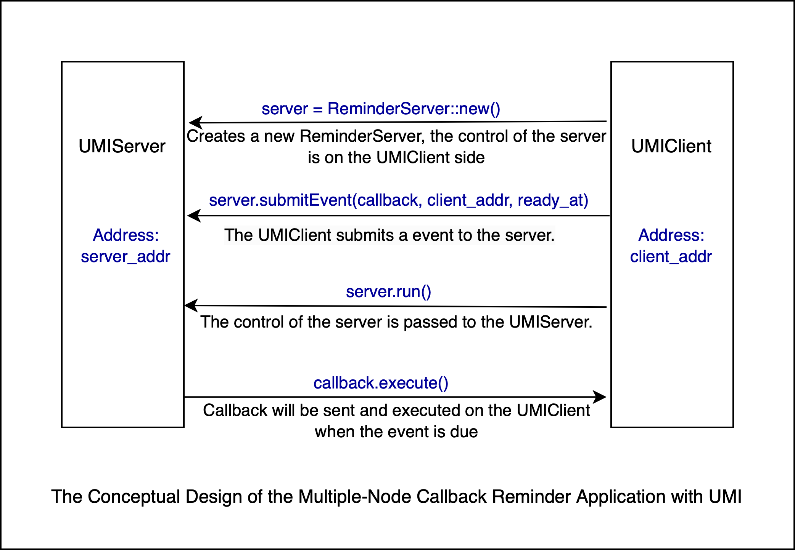

# Experiment UMI - A Callback Reminder
This repository is prepared for evaluating the effort of using our UMI library to refactor an application that runs on a single node into an application that runs on multiple nodes.

## Application Directory and Library Directory
- All application code to be worked on for this experiment are located in the directory: `./applications/`. Please only modify code under this directory.
    - `./applications/examples/` contains application code to be executed.
    - `./applications/src/` contains stucts definitions for single and mutiple node applications.
- Directories `./src/` and `./umi_macros/` contains UMI library code. Please do not modify code under these directories.

## Getting Started
- Forking the repository.
- Cloning the forked repository into your own machine.
- Make sure you are under the directory `./applications/`
- Running all tests: `cargo test`
    - You should see the following output:
    ```
    running 2 tests
    test reminder::ready_reminder_callback_server::tests::cmp_works ... ok
    test reminder::ready_reminder_callback_server::tests::gt_works ... ok
    ```
- Executing the provided single node application: `cargo run --example ready_reminder_callback_client_single`
    - You should see the following output:
    ```
    Task Hello World! is due
    Task Goodbye World! is due
    ```

- __Please only work and modify code provided in the `./applications/` directory and please do not modify the provided library code in `./src/`__

## The Design of the Multiple-Node Callback Reminder Application
 

## Instructions of Using UMI Library
### UMI Structs
#### __`umi::endpoint::UMIEndpoint`__
```rust
pub struct UMIEndpoint {
    listener: TcpListener,
}
```
- Creating a new `UMIEndpoint` to listen and response to requests from clients:
```rust
pub fn new<A: ToSocketAddrs>(addr: A) -> UMIEndpoint
```
- Starting a `UMIEndpoint`:
```rust
pub fn start(&mut self, registry_table: RegistryTable, vtable: Arc<Mutex<ResourceTable>>)
```

#### __`umi::endpoint::ResourceTable`__
A `ResourceTable` is a type alias of a `std::collections::HashMap`.
```rust
pub type ResourceTable = HashMap<ID, RefCell<(Box<dyn Any + Send + Sync>, bool)>>;
```

#### __`umi::registry::RegistryTable`__
A `ResourceTable` is a type alias of a `std::collections::HashMap`.
```rust
pub type RegistryTable = HashMap<&'static str, Box<dyn GenCall>>;
```

### __`umi::proxy_lib::callback::CallBack`__
A `CallBack` defines the callback function, it works as a closure. It contains the data of a event. In this application, a `CallBack` should be executed when an event is due. It can be passed as an argument of a method. You __do not__ need to register a callback function to be able to execute it.

### UMI Macros
#### __`umi::remote`__
`remote!(...)` is used:
- as the entry point of an multiple-node application. A client can use it to send an request to a server to initialise tha allocation of some resources. It will return a proxy to the client than can be used to invoking computation on the the server if the initial allocation is successful.
    ```rust
    remote!(addr, method_name, return_type);
    ```
    An example usage is:
    ```rust
    let mut a = remote!("127.0.0.1:3334", A::new, A);
    ```
    This creates a `A` on the server with the address `127.0.0.1:3334`. It returns a proxy `a` to the client. On the client, methods can be directly invoked on this proxy. The actual computation will be sent to the server and the result of the computation will be sent back to the client.
- to pass a callback function to a client and execute it. A `CallBack` can be passed into `remote!`
    ```rust
    remote!(addr, callback);
    ```
    An example usage is:
    ```rust
    let my_callback = event.callback;
    let callback_addr = /* the callback address of the event */;
    ...
    remote!(callback_addr, my_callback);
    ```
    This will execute the callback function `my_callback` on the node with address `callback_addr`.
#### __`umi::register`__
`register!(...)` requires `std::any::Any` to be imported. It is used to register methods in the `RegistryTable` for remote invocation.
```rust
register!(registry_table, registry_name, method_name, method_type_signature, (method_return_type, method_return_ownership), argument_types*, argument_ownerships*)
```
Suppose we have a struct `A` with a method `fn foo(&self, u32)`
```rust
register!(table, // method registry table
    A, // method registry name
    A::foo, // method name
    fn(&A, u32),  // method signature
    ((), ResultOp::Owned), // method return type and ownership
    A, u32, // argument types
    &A, u32); // argument ownership
```
#### __`umi_macro_proc::proxy_me`__
`#[proxy_me]` makes a struct able to represent both local resouce and a proxy. An example usage:
```rust
#[proxy_me]
pub struct A {
    bar: u32
}
```
#### __`umi_macro_proc::umi_init`__
`#[umi_init]` makes a initialisation call `new` able to be sent to a remote node and return a proxy to the local node. An example usage is in `student.rs`:
```rust
#[umi_init]
pub fn new() -> Self {
    A {
        bar: 0
    }
}
```
This allows `new()` to be send in the entry point:
```rust
let mut a = remote!("127.0.0.1:3334", A::new, A);
```

#### __`umi_macro_proc::umi_struct_method(option)`__
`#[umi_struct_method]` makes a struct method able to be also invoked on a proxy. `#[umi_struct_method(false)]` specifically indicates that the return value is sent back by copy/move and it **does not** have a proxy representation.

#### __`umi_macro_proc::setup_packages`__ 
`setup_packages!();` imports relevant hidden crates for message serialisation.

#### __`umi_macro_proc::setup_registry`__
`setup_registry!();` imports relevant hidden crates for method registry.

#### __`umi_macro_proc::setup_proc_macros`__
`setup_proc_macros!();` imports relevant hidden crates for using umi macros.

## Task
- Please refactor the single node reminder application `./applications/examples/ready_reminder_callback_client_single.rs` using the UMI library to run on multiple nodes. The `ReadyReminderServer` should run on a node, accepting requests from client(s) nodes that submit events, and notifying clients when events are ready.
    - You should first consider modifying `./applications/src/reminder/ready_reminder_callback_server.rs`.
    
<details><summary> Need a hint? </summary>
<p>
The client needs a port with fixed address for listening callbacks.
</p>
</details>


## Evaluation

Please work independently of the other participants.

Please keep track of the amount of time that you spend on various programming tasks (including but not limited to reading documentations, seeking support, design, implementation, testing, and debugging). For each task please record observations if pertinent (especially levels of satisfaction or frustration with the process).